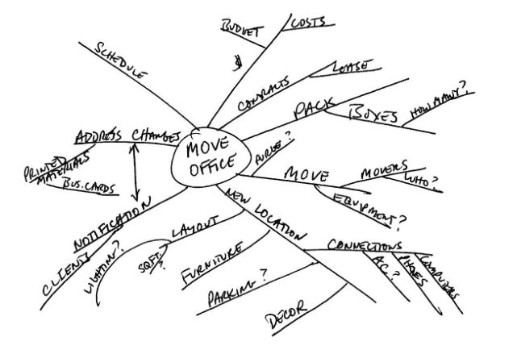

# Getting Things Done by David Allen - In-Depth Summary

**Source:** [https://www.lucapallotta.com/book-summary-getting-things-done-by-david-allen/](https://www.lucapallotta.com/book-summary-getting-things-done-by-david-allen/)

**Author:** Luca Pallotta

---

## Overview

"Getting Things Done" (GTD) is a productivity methodology designed to help individuals achieve **"Mind Like Water"**—a state of complete mental clarity and readiness. Published in 2001 by David Allen, the system focuses on capturing tasks externally rather than relying on mental recall, enabling greater focus and reduced stress.

## Core Philosophy

### The Primary Problem

Modern knowledge work lacks clear boundaries, creating constant overwhelm through:

- Blurred lines between professional and personal responsibilities
- Information overload from technology and connectivity
- Rapid organizational and personal changes
- Inadequate traditional time-management approaches

### The Solution: Three Key Objectives

1. **Capture everything** requiring attention in a trusted external system
2. Make **decisive front-end decisions** about all inputs to maintain actionable inventory
3. **Curate and coordinate** content while managing multiple commitment levels

### Central Principle

**Unfinished tasks create "open loops" that occupy mental RAM.** Stress stems from inappropriately managed commitments rather than actual workload volume.

The key insight: Your mind is terrible at remembering tasks at the right time, but it's excellent at processing information. GTD leverages this by using external systems for storage and your brain for thinking.

---

## Part One: The Art of Getting Things Done

### The Five Workflow Stages

#### 1. Capture

**Goal:** Collect all incomplete items into physical or digital in-trays

**Tools include:**
- Physical trays
- Notebooks
- Digital devices
- Email inboxes
- Voice notes

**Success requires:**
- Comprehensive collection (capture everything)
- Minimized capture locations (as few inboxes as possible)
- Regular emptying (process your inboxes)

**Key principle:** Get everything out of your head and into a trusted system.

#### 2. Clarify

Process each item by asking:

**Is this actionable?**

- **NO**:
  - Delete it
  - Incubate it (defer decision for later)
  - File as reference

- **YES**:
  - Is it a project? (requires multiple steps)
  - What's the next **physical action**?

**The Two-Minute Rule:** Complete actions under two minutes immediately

**Otherwise:**
- **Do it** (schedule time for it)
- **Delegate it** (assign to someone else)
- **Defer it** (add to next actions list)

**Critical distinction:** "Next action" must be a **physical, visible action**, not a vague intention like "handle project X" but specific like "email John for budget approval."

#### 3. Organize

Store processed items in eight categories:

**Actionable Items:**

1. **Projects list** - Outcomes requiring multiple steps (any goal needing >1 action)
2. **Project support materials** - Reference materials for active projects
3. **Calendar** - Time/day-specific actions ONLY (appointments, deadlines)
4. **Next Actions lists** - Typically organized by context:
   - @calls - Phone calls to make
   - @computer - Tasks requiring a computer
   - @errands - Things to do when out
   - @home - Home-specific tasks
   - @office - Office-specific tasks
   - @waiting-for - Delegated tasks
5. **Waiting For list** - Delegated tasks or items blocked by others

**Non-Actionable Items:**

6. **Trash** - Delete what's not needed
7. **Incubation**:
   - Someday/Maybe lists - Ideas for potential future action
   - Tickler systems - Date-based reminders for future review
8. **Reference materials** - Physical and digital filing for information you want to keep

**Key organizational principle:** Context-based lists allow you to see all available actions based on your current situation (location, tools available, etc.)

#### 4. Reflect

Review systems regularly to maintain trust:

**Weekly Review** (Critical!)

The weekly review is the **most important** habit in GTD:

- Examine all projects
- Review all next actions
- Check waiting items
- Review someday/maybe lists
- Ensure calendar is up to date
- Process all inboxes to zero

**Purpose:** Ensures system remains current and complete, prevents your mind from reclaiming the reminder function.

**Timing:** Set aside 1-2 hours weekly (Friday afternoon or Sunday evening works well)

**Daily Reviews:**
- Check calendar
- Review next actions for the day
- Process inbox

#### 5. Engage

Make confident action choices using three decision models:

**Model 1: Four Criteria in the Moment**

When deciding what to do, consider:

1. **Context** - Where are you? What tools are available?
2. **Time available** - How much time until your next commitment?
3. **Energy available** - How much mental/physical energy do you have?
4. **Priority** - Given the above constraints, what's most important?

**Model 2: Three Types of Daily Work**

Balance your time across:

1. **Predefined work** - Doing tasks from your next actions lists
2. **Work as it shows up** - Handling unexpected demands and interruptions
3. **Defining work** - Processing, clarifying, organizing new inputs

**Model 3: Six Horizons of Focus**

Maintain perspective across different altitudes:

- **Horizon 5:** Purpose and principles - Why do you exist? Core values
- **Horizon 4:** Vision (3-5 years) - Long-term direction
- **Horizon 3:** Goals (1-2 years) - Medium-term objectives
- **Horizon 2:** Areas of focus and accountability - Key life/work responsibilities
- **Horizon 1:** Current projects - Active outcomes requiring multiple actions
- **Ground:** Current actions - Next physical actions to take

**Using the models:** Start with the four criteria moment-by-moment, periodically review your three types of work balance, and regularly reflect on your six horizons during weekly/monthly reviews.

---

## Part Two: Project Planning

### The Natural Planning Model

GTD describes how humans naturally plan effectively (like planning dinner out, a vacation, or a product launch):

#### 1. Purpose

**Define the "why"** to establish:
- Success criteria
- Decision-making framework
- Motivation and inspiration

**Questions to ask:**
- Why are we doing this?
- What would success look like?
- What value will this create?

#### 2. Principles

**Identify values and boundaries** governing the project:
- What standards apply?
- What behaviors are acceptable/unacceptable?
- What constraints exist?

**Examples:**
- "Budget must stay under $10,000"
- "Must involve input from all stakeholders"
- "Solution must be eco-friendly"

#### 3. Vision

**Clearly envision the desired outcome**

Use "what if" thinking:
- What will this look like when complete?
- What will we see, hear, feel?
- What will have changed?

**Technique:** Write a "done" scenario describing the completed project in detail.

#### 4. Brainstorming

**Generate ideas externally** to access "distributed cognition"

**Methods:**
- Mind mapping
- Lists
- Sticky notes
- Free-form notes

**Rules:**
- Don't judge or evaluate during brainstorming
- Go for quantity over quality
- External capture is essential (don't just think about it)

#### 5. Organizing

**Sort ideas** by:
- Components (major parts/phases)
- Sequences (what order?)
- Priorities (what matters most?)

**Create structure:**
- Outline key sections
- Identify dependencies
- Establish timeline

#### 6. Next Actions

**Identify immediate physical steps** for each moving part

For every component that needs to move forward:
- What's the very next physical, visible action?
- Who will do it?
- By when?

### Planning Levels

How much planning do different projects need?

- **80% of projects:** Need only outcome and next action (internal thinking)
  - Example: "Buy birthday gift for Mom" → Next action: "Browse Amazon for gift ideas"

- **15% of projects:** Require external brainstorming (notes, mind maps)
  - Example: Planning a team offsite

- **5% of projects:** Benefit from full five-phase modeling (complex, high-stakes initiatives)
  - Example: Product launch, organizational restructuring, major life changes

**Key insight:** Don't over-plan simple projects, but don't under-plan complex ones.

---

## Part Three: Implementation

### Setting Up the System

#### Time and Space Requirements

**Initial Setup:**
- Dedicate **two full days** for initial setup (ideally consecutive)
- This includes gathering, processing, organizing everything

**Workspace:**
- Establish **dedicated workspace** with:
  - In-tray for physical items
  - Writing surface
  - Storage for filing
  - Computer/digital tools
- Maintain **both home and office** spaces separately

**Why two spaces?** Work and personal lives have different contexts and requirements. Keeping them separate prevents cross-contamination.

#### Essential Tools

**Physical Tools:**
- In-trays
- Paper and pads
- Pens and pencils
- Post-its
- File folders
- Calendar
- Wastebasket
- Label maker

**Digital Tools:**
- Email system
- Note-taking apps
- Task management software
- Project management tools
- Digital filing system
- Calendar app

**Filing System Principles:**

Both physical and digital filing systems need:
- **Single alphabetical system** by topic/person/project
- **Quick filing and retrieval** (under 60 seconds)
- **Regular archiving** of completed projects
- **Annual purging** to keep current

**Filing structure examples:**
- By client name
- By project name
- By reference category (Finance, Legal, Marketing, etc.)

### Capture Phase: Gathering

#### Physical Gathering

Systematically collect all incomplete items from:

**Home/Office:**
- Desktops and drawers
- Countertops and cabinets
- Floors, walls, shelves
- Equipment and furniture
- Closets and storage areas
- Car
- Off-site storage

**What stays in place:**
- Supplies (pens, paper, etc.)
- Reference materials currently in use
- Decoration
- Equipment that doesn't require action

**Gathering guidelines:**
- Put physical items in your in-tray
- Write notes for items too large to move
- Don't organize or purge yet—just collect
- Date all written items

#### Mental Gathering

**Externalize thoughts** using incompletion triggers across life areas:

**Professional:**
- Projects started but not completed
- Projects that need to be started
- Commitments/promises to others
- Communications needed
- Writing to be done
- Meetings that need to be scheduled
- Financial matters
- Planning and organizing
- Professional development
- Staff issues
- Systems and processes

**Personal:**
- Projects and interests
- Family responsibilities
- Health and fitness
- Social commitments
- Financial planning
- Home maintenance
- Hobbies and recreation
- Spiritual development

**Technique:** Use a comprehensive trigger list to jog your memory. The goal is to identify every "open loop" occupying mental space.

### Processing Strategy

**Golden Rules:**

1. **Don't organize while gathering** - Collect first, process later
2. **Write separate notes** for oversized items
3. **Date all written items** for context
4. **Resist purging** during collection phase
5. **Process existing lists** as raw input (don't assume they're current)

**The Processing Flow:**

For each item in your in-tray:
1. What is it?
2. Is it actionable?
3. If yes: What's the next action?
4. Will it take less than 2 minutes?
5. Where does it go?

**Process in order** - Don't cherry-pick easy items. Build the discipline of processing top-to-bottom.

---

## Key Concepts Deep Dive

### "Mind Like Water"

**Definition:** A state of complete readiness where responses match input appropriately, neither overreacting nor underreacting.

**Metaphor:** Water responds perfectly to whatever disturbs it:
- A pebble creates a small ripple
- A boulder creates a large wave
- Once the disturbance is gone, the water returns to calm

**How to achieve it:** External task management rather than mental retention. When your system is complete and current, your mind can be calm like water.

### Open Loops

**Definition:** Incomplete commitments occupying mental space.

**Problem:** Every open loop:
- Uses mental RAM
- Creates background stress
- Distracts from current focus
- Triggers at inappropriate times

**Solution:** Capture externally and track in trusted systems to free cognitive resources.

**Example:** Remembering "need to call dentist" while trying to write a report is an open loop. Capturing it in your system closes the loop mentally.

### The Two-Minute Rule

**Principle:** Actions requiring under two minutes should be completed immediately rather than added to lists.

**Reasoning:**
- Prevents system overload
- Processing time ~= doing time
- Maintains momentum
- Reduces list length

**Application:**
- Quick emails
- Brief phone calls
- Simple filing
- Easy decisions

**Exception:** If you're in the middle of processing mode, batch 2-minute tasks for later if they'd disrupt your flow.

### Weekly Review

**Why it's critical:** The Weekly Review is the **cornerstone habit** of GTD.

**Without it:**
- System becomes stale
- Trust erodes
- Mind takes over reminding function
- Stress returns

**With it:**
- System stays current
- Trust remains high
- Mind stays calm
- You feel in control

**Complete Weekly Review Checklist:**

1. **Capture loose papers and materials**
2. **Process your notes**
3. **Review previous calendar entries** (past week)
4. **Check upcoming calendar** (next 2-3 weeks)
5. **Empty your head** - write down new items
6. **Review Projects list** (current and upcoming)
7. **Review Next Actions lists**
8. **Review Waiting For list**
9. **Review Someday/Maybe lists**
10. **Be creative and courageous** - any new projects?

**Time investment:** 1-2 hours weekly, typically Friday afternoon or Sunday evening.

### Context-Based Organization

**Concept:** Grouping next actions by circumstance allows efficient action selection based on available resources.

**Common contexts:**
- **@calls** - Requires phone
- **@computer** - Requires computer
- **@errands** - Out and about
- **@home** - At home
- **@office** - At office
- **@waiting-for** - Waiting on someone else
- **@read/review** - Reading materials
- **@agenda-[person]** - Items to discuss with specific people

**Benefits:**
- See all available actions for current situation
- Batch similar tasks efficiently
- Make better decisions about what to do now
- Reduce context switching

**Energy-based contexts:**
- @high-energy - Requires peak mental state
- @low-energy - Can do when tired
- @creative - Needs creative thinking

---

## Success Factors

GTD works when you have:

1. **Comprehensive capture** - Prevents nagging incompletions
2. **Rigorous clarification** - Transforms ambiguous "stuff" into clear actions
3. **Trusted organization** - Enables delegation to external memory
4. **Consistent reflection** - Maintains system functionality
5. **Confident engagement** - Follows from complete, current, reviewed system

**The virtuous cycle:**
- Trust your system → Mind relaxes → Better thinking → Complete system → Trust grows

**The vicious cycle:**
- Distrust system → Mind takes over → Stress increases → System neglected → Trust erodes

---

## Common Pitfalls and Solutions

### Pitfall 1: Incomplete Capture

**Problem:** Not capturing everything, keeping some items "in your head"

**Solution:** Ubiquitous capture tools (phone, notepad always accessible)

### Pitfall 2: Vague Next Actions

**Problem:** Next actions like "Deal with project X" create resistance

**Solution:** Define specific physical actions: "Email Sarah requesting budget draft"

### Pitfall 3: Skipping Weekly Review

**Problem:** System becomes stale, trust erodes

**Solution:** Schedule it as a non-negotiable appointment with yourself

### Pitfall 4: Calendar Misuse

**Problem:** Putting aspirational tasks on calendar instead of hard commitments

**Solution:** Only time/date-specific items on calendar. Everything else on next actions lists.

### Pitfall 5: Over-Organizing

**Problem:** Creating complex category systems that slow you down

**Solution:** Keep it simple. Start with basic contexts and only add complexity if needed.

### Pitfall 6: Perfectionism

**Problem:** Trying to create the perfect system before starting

**Solution:** Start simple, iterate and improve over time.

---

## The GTD Methodology Addresses

Modern knowledge work complexity through:

- **Systematic externalization** of mental burden
- **Enabling sustained focus** through trusted systems
- **Promoting creativity** by freeing mental capacity
- **Appropriate responsiveness** to changing circumstances
- **Reduced stress** through clarity and control

**Core realization:** You can't manage time (it's fixed), but you can manage your attention and actions. GTD provides the framework for doing this effectively.

---

## Implementation Recommendations

### Week 1-2: Setup

- Dedicate two days to initial setup
- Gather everything
- Process to empty
- Set up lists and systems

### Week 3-4: Practice

- Daily inbox processing
- Regular capture
- Defining next actions
- First weekly review

### Month 2-3: Refinement

- Adjust contexts as needed
- Refine filing systems
- Optimize tools
- Build weekly review habit

### Month 4+: Mastery

- System becomes second nature
- Intuitive action choices
- Mind like water achieved
- Continuous improvement

**Key to success:** Consistency over perfection. Better to have a simple system you use daily than a perfect system you abandon.

---

## Further Reading

**The Book:**
- *Getting Things Done: The Art of Stress-Free Productivity* by David Allen
- Updated edition (2015) includes digital age updates

**Additional Resources:**
- [Getting Things Done Official Website](https://gettingthingsdone.com/)
- David Allen Company coaching and training
- GTD Connect community
- Numerous GTD implementation guides for specific tools

**Related Concepts:**
- **Mind sweeps** - Regular brainstorming sessions to capture open loops
- **Trigger lists** - Checklists to prompt comprehensive thinking
- **Natural planning vs. reactive planning** - Proactive vs. crisis-driven approaches
- **Horizontal vs. vertical focus** - Breadth (all projects) vs. depth (single project)

---

**Final Thought:**

GTD is not about doing more—it's about **having appropriate engagement with your world**. It's about being able to focus completely on what you're doing while maintaining confidence that you're not missing anything important elsewhere.

As David Allen says: *"Your mind is for having ideas, not holding them."*

---

**Disclaimer:** This is an educational summary for personal reference. For the complete methodology with all nuances and details, read the full book "Getting Things Done" by David Allen.
